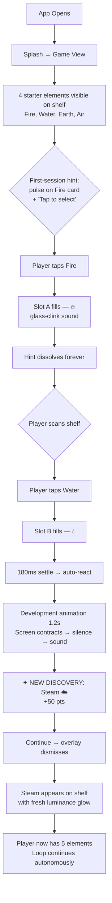
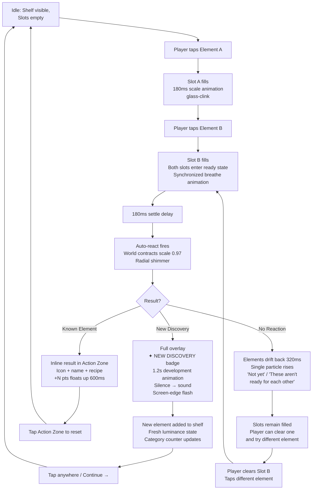
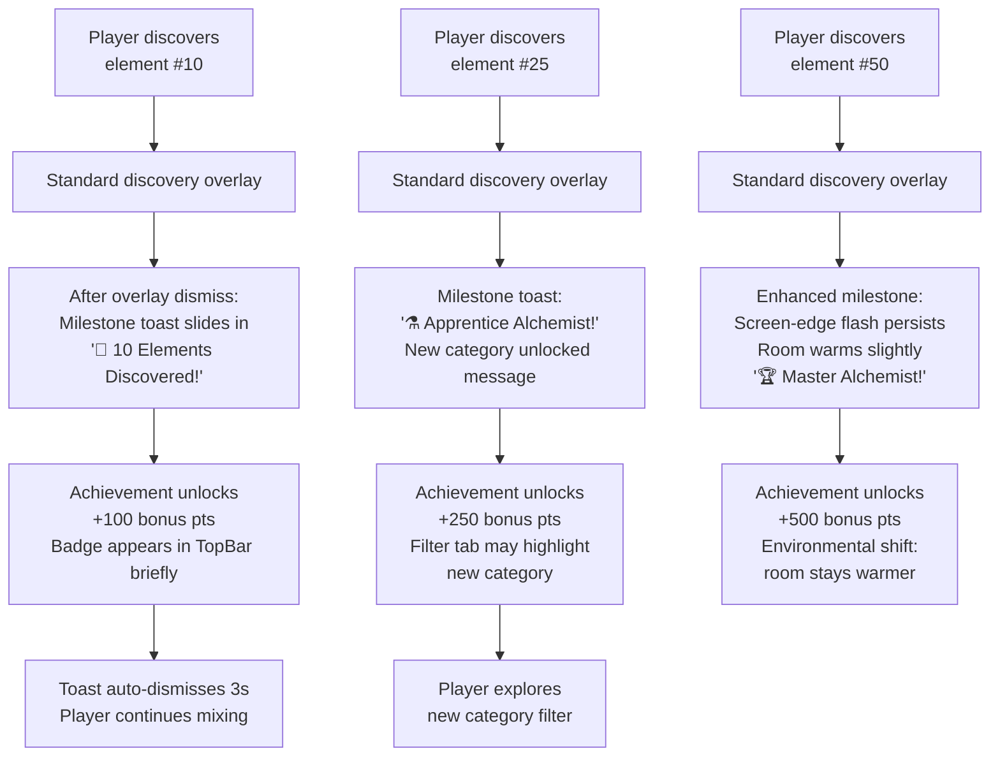
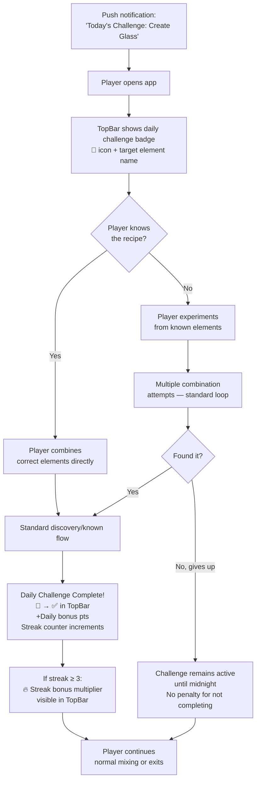
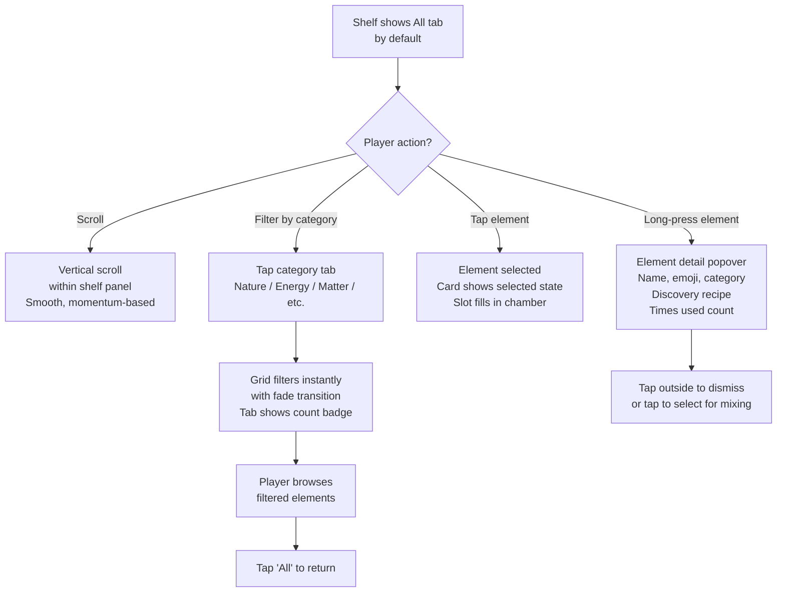
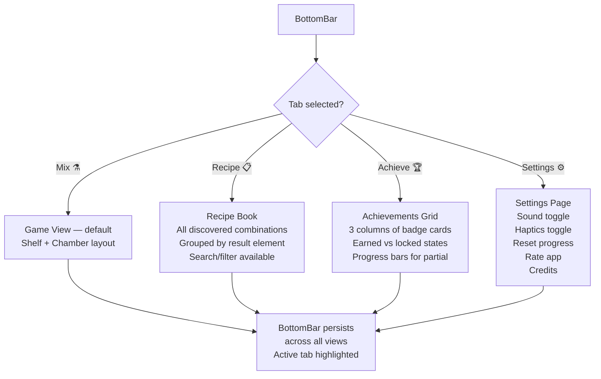

# UX Design Specification Alchemica

**Author:** Mostafa
**Date:** 2026-05-09

---

## Executive Summary

### Project Vision

Alchemica is a mobile-first PWA casual/educational puzzle game where players combine elements in a mixing chamber to discover new compounds — inspired by real chemistry but prioritizing fun and wonder over accuracy. Currently at v2 (achievements, daily challenge, streak), built with SvelteKit + Capacitor, landscape-locked.

The core fantasy is evolving from "I am a scientist discovering the building blocks of the universe" toward something deeper: **"I am an alchemist in an ancient workshop, uncovering things that were always there."** The visual direction brainstorming session established a rich material language — dark brass, apothecary glass, warm dark stone — and five emotional principles (wonder, discovery, mastery, failure-as-not-yet, power) that should guide every UX decision.

The competitive gap Alchemica aims to exploit: Little Alchemy proved the combination mechanic works. No game in this genre has attempted **simple system + profound atmosphere**. Alchemica's UX must deliver that atmosphere.

### Target Users

- **Ages 10+** — casual players and science-curious students
- **Mobile-first** — OLED phones, one-thumb landscape use
- **Tech-savvy range:** low to medium (interactions must be self-explanatory)
- **Accessibility:** deuteranopia/protanopia consideration, WCAG AA compliance, 44px minimum touch targets
- **Session context:** short bursts ("one more reaction") with risk of eye fatigue on dark screens during sustained play
- **Motivation profile:** curiosity-driven discoverers, not competitive grinders — reward exploration, not speed

### Key Design Challenges

1. **Visual identity crisis** — The game is about fire, plasma, and discovery but currently reads as cold, clinical, submarine-control-room UI. The brainstorming demands a thermal shift from navy-cold to stone-warm without losing darkness.
2. **Flat visual hierarchy** — Every element card has identical visual weight. Rarity, frequency-of-use, and category are invisible. The shelf should become "a portrait of the player, not a catalogue of the game."
3. **Discovery moment is confirmation, not revelation** — The reaction result currently feels like a database write, not a moment of astonishment. The brainstorming demands emergence-not-delivery, silence-before-sound, resistance-before-revelation.
4. **28 existing UX issues** — Including P0 items (no reset confirmation, discovery log broken on desktop, blocked pinch-to-zoom) and P1 touch-target violations throughout.
5. **Onboarding void** — No first-run instruction exists. New players face a blank interface with no guidance.
6. **Failure feedback is punitive** — "No Reaction" with red text feels like rejection. The brainstorming demands "not-yet" language: the door listening, not the bouncer turning away.

### Design Opportunities

1. **The "ancient workshop" material language** — Dark brass, apothecary glass, warm stone as a complete visual identity. No competitor in the element-combination genre has attempted this atmospheric depth.
2. **Discovery as the hero moment** — A 1.2-second development animation (emergence, not pop-in), world contraction then expansion, silence-then-sound. Could be the most memorable moment in any casual mobile game in this genre.
3. **Shelf as player portrait** — Elements gaining visual "memory" (settled vs. luminous, old friends vs. new arrivals) would make every player's shelf uniquely theirs.
4. **Power through presence, not decoration** — High-energy elements making surroundings quieter, creating no-temperature light, subtle nearly-imagined pulses. Obra Dinn discipline applied to a casual game.
5. **The genre gap** — Simple system + profound atmosphere. The formula the genre has never attempted.

## Core User Experience

### Defining Experience

The core experience of Alchemica is a **discovery loop** — a 3-5 second cycle of hypothesis, combination, and revelation. The player's primary action is selecting two elements and observing what emerges. This loop must feel like conducting an experiment in an ancient workshop, not operating a software tool.

The loop anatomy:
1. **Hypothesis** (~1s) — Player scans the shelf, notices elements, forms a guess ("What if Fire + Earth?")
2. **Combination** (~1s) — Two taps to fill slots. Auto-react fires after 180ms settle delay.
3. **Revelation** (~1.5s) — Result develops through resistance, emerges rather than appears. New element takes its first breath on the shelf.
4. **Invitation** (~0.5s) — The new element's presence on the shelf immediately suggests new combinations. The loop restarts.

The defining quality: every cycle should make the player feel like a *discoverer*, not a *player completing a task*.

### Platform Strategy

- **Primary:** Mobile PWA (iOS + Android), OLED screens, landscape-locked
- **Input:** Touch-first, one-thumb reachable. 44px minimum touch targets (WCAG 2.5.5 + Apple HIG)
- **Offline:** Full offline capability via Service Worker — all game logic client-side, localStorage persistence
- **Secondary:** Desktop browser (tablet/desktop breakpoints at 769px and 1025px)
- **Rendering:** Svelte 5 reactive UI + Canvas API particle effects, Web Audio API sound
- **Distribution:** Capacitor wrapping for App Store / Play Store presence
- **Constraint:** 216px minimum game area height (iPhone SE landscape after bars). All critical interactions must fit.

### Effortless Interactions

**Must feel effortless (zero cognitive load):**
- **Element selection:** Tap a card → it fills a slot. Third tap replaces Slot A silently. No confirmation, no menu.
- **Result comprehension:** The result tells the player what happened through visual language alone — no text reading required for the core loop.
- **Shelf navigation:** Category tabs, swipe-between-tabs gesture, immediate filter response. The shelf should feel like running your fingers across bottles on a real shelf.
- **Retry:** Clearing a slot or tapping the result zone to reset. One gesture, no confirmation.

**Must feel effortless but currently doesn't (the gaps):**
- **First session:** Currently no onboarding. Should be contextual — first slot fill triggers a gentle "now pick another" prompt, then auto-react teaches itself. No tutorial screen, no modal. The room teaches you.
- **Failure understanding:** "No Reaction" is a wall. "Not yet" with a single rising particle is a door that hasn't opened.
- **Finding elements at scale:** With 32+ elements, scanning a flat grid becomes work. Search, category progress, and visual hierarchy by usage frequency would make the shelf self-organizing.

### Critical Success Moments

1. **First discovery** (session 1, ~30 seconds in) — Fire + Water → Steam. The first time the workshop reveals something. If this moment doesn't create wonder, nothing else matters. This must be the best-animated, most satisfying interaction in the entire game.

2. **First "I didn't expect that"** (session 1-2) — A combination that surprises. Earth + Fire → Lava, or a counterintuitive result. The moment curiosity shifts from "let me try everything" to "what ELSE is hiding in here?"

3. **First failure that invites** (session 1) — A combination that doesn't work, but the failure feels like the universe registered the attempt. One particle rises. The player tries again instead of quitting.

4. **Shelf recognition** (session 5+) — The player glances at their shelf and sees their own history — settled elements they've used hundreds of times, luminous new arrivals, categories filling in. The shelf is a portrait, not a catalogue.

5. **Daily challenge completion** — The streak counter incrementing. A ritual that brings the player back tomorrow. The daily challenge is the retention backbone.

### Experience Principles

1. **The room teaches.** No tutorials, no modals, no instruction screens. The first slot fill, the first auto-react, the first discovery overlay — each interaction teaches the next one. If the player needs to read instructions, the design has failed.

2. **Emergence, not delivery.** Elements are not *given* to the player — they are *revealed*. The new element was always there; the player uncovered it. Every animation, every sound cue, every visual transition should convey discovery, not receipt.

3. **Silence before sound.** The most powerful moments in the game are the half-beats of stillness — the 180ms before auto-react fires, the brief contraction before a discovery expands, the single particle rising from a failed combination. Restraint creates presence.

4. **The shelf is alive.** It has memory. Recently discovered elements still glow. Old friends have settled. Power elements make their surroundings quieter. The shelf breathes at its own rhythm, and every player's shelf looks different because it reflects their history.

5. **Not-yet, never wrong.** Failed combinations are not errors — they are unanswered questions. The UI language, animation, and copy must never punish experimentation. The universe is listening, even when it doesn't respond.

## Desired Emotional Response

### Primary Emotional Goals

**The overarching feeling:** *Concentrated curiosity in a warm, ancient, slightly dangerous room.*

Not cheerful. Not clinical. Not competitive. The player should feel like they've entered a place where serious work happens — work that predates them — and they've been trusted to touch things.

| Priority | Emotion | One-sentence target |
|----------|---------|-------------------|
| 1 | **Wonder** | "I believe things are happening in this darkness I haven't discovered yet." |
| 2 | **Discovery** | "I didn't create this — I released it. It was always there." |
| 3 | **Mastery** | "This shelf is mine. I can read it like a language I learned by doing." |
| 4 | **Not-yet** (failure) | "Something was listening. It considered my attempt. It isn't ready yet." |
| 5 | **Presence** (power) | "This element is different. I can feel it without anyone telling me." |

**The emotion to avoid above all:** *Feeling like you're operating a system.* Database writes, confirmation dialogs, clinical feedback, score-first displays — anything that breaks the fiction that you are standing in a room with real things.

### Emotional Journey Mapping

| Moment | Emotional state | Design implication |
|--------|----------------|-------------------|
| **App opens** | Arrival — entering the workshop | No splash screen. The room is already there, lit from within. Transition feels like walking in, not loading. |
| **First glance at shelf** | Curiosity + slight overwhelm | The shelf goes further back than you can see. Depth is inhabited, not empty. Starting elements glow gently — they're waiting. |
| **First element tap** | Small commitment | Slot fills with a subtle glass-clinking weight. The room registers the action. |
| **Second element tap** | Anticipation — the 180ms hold | Both slots glow. Brief stillness. The world contracts slightly. Something is about to happen. |
| **Successful reaction (known)** | Satisfaction — the craftsman's nod | Quick, clean. "+10" floats. No ceremony for familiar work. The expert doesn't celebrate the ordinary. |
| **New discovery** | Astonishment → joy | World contracts. 1.2s of development — element fights to exist, arrives through resistance. Half-beat of silence. Then sound. Then the shelf receives it. First breath. |
| **Failed combination** | Not-yet — the open question | Elements drift back gently, like a librarian returning an unavailable book. Single particle rises. Ghost of something that almost formed. The door is listening. |
| **Shelf at day 30** | Ownership — this is mine | Old elements have settled. New arrivals still luminous. The shelf is a portrait of the player's history. Mastery is horizontal — moving through a mapped space. |
| **Encountering Plasma** | Awe through stillness | Surroundings go quieter. No-temperature light. A pulse you're not sure you imagined. The finger hesitates — not because the UI warns, but because the light changed. |
| **Daily challenge complete** | Ritual satisfaction | The streak increments. A small flame burns steadier. Tomorrow has a reason. |
| **Closing the app** | Reluctant departure | The room stays. You're leaving it, not shutting it down. |

### Micro-Emotions

**Confidence over confusion:**
- The room teaches through doing, never through instruction. Each successful interaction builds spatial memory. By session 3, the player's fingers know where things are before their eyes confirm.
- Confidence is built by *consistency* — the slots are always in the same place, the result always appears in the same zone, the shelf always responds the same way.

**Trust over skepticism:**
- The game never lies. If a combination doesn't work, it genuinely doesn't work — no hidden timers, no randomness, no "try again later." Determinism is trust.
- The discovery log is a contract: everything you found is recorded and accessible. Nothing disappears.

**Curiosity over anxiety:**
- No timer. No lives. No penalty for failure. No leaderboard pressure. The only motivator is "what else is in here?"
- The shelf's visual depth — suggesting elements beyond what's visible — maintains curiosity even after dozens of sessions.

**Accomplishment over frustration:**
- Every session produces something. Even a session of failures produces the particle, the ghost, the "not yet" — evidence the universe noticed.
- Category progress bars would transform "I haven't found much" into "I'm 3/8 through Metal."

### Design Implications

| Emotional goal | UX mechanism |
|---------------|-------------|
| Wonder (fog is promising) | Shelf visual depth — elements fade into inhabited darkness at edges. Background is a room, not a void. |
| Discovery (emergence) | 1.2s development animation with resistance. Scale 0.1→1.0 spring curve. Silence-then-sound timing. Screen-edge flash. |
| Mastery (portrait) | Element cards track usage frequency. High-use = settled, low border emphasis. New = luminous, unsettled. Visual state is earned, not assigned. |
| Not-yet (the door listens) | No red. No "No Reaction." Elements drift back gently. Single particle rises. Ghost wisp of a reaction that didn't find its footing. Copy: "Not yet" / "These aren't ready for each other." |
| Presence (power) | High-energy elements: faint luminance pulse (barely perceptible), surrounding cards slightly more still. No-temperature light — not warm, not cold. No warning icon. The visual register alone creates hesitation. |
| Trust (determinism) | Same inputs always produce same outputs. Discovery log is permanent. Progress never resets without explicit destructive confirmation. |
| Confidence (spatial memory) | Fixed layout zones. Result always in the same place. Shelf always in the same place. Muscle memory forms naturally. |

### Emotional Design Principles

1. **Warmth in the dark.** Not lighter — warmer. The background shifts from navy-cold (`#0a1520`) to stone-warm (`~#0e0a07`). A lantern at night is a world. Keep the dark. Change its temperature.

2. **The room has been here longer than you.** Nothing performs newness. The interface doesn't feel designed — it feels found. Brass is worn at the high points. Glass has absorbed what it contained. Stone holds heat from old reactions. Everything belongs.

3. **Less is louder.** A single particle communicates more than a red error banner. A half-beat of silence before a discovery sound creates more impact than a louder sound. A barely-perceptible pulse on Plasma says more than a glowing border. Restraint is the primary emotional tool.

4. **The body knows before the mind.** The player's finger hesitates before touching Plasma — not because the UI said "dangerous" but because the light changed. The player's eyes land on the new element before reading its name because the glow is different. Design for the peripheral nervous system, not just the visual cortex.

5. **Every moment earns its presence.** Nothing decorative. Every glow, every animation, every sound must answer: "What work are you doing that nothing else is doing?" If it can't answer, it doesn't belong in the room. (Obra Dinn discipline.)

## UX Pattern Analysis & Inspiration

### Inspiring Products Analysis

**Outer Wilds — The gold standard for discovery UX**
- *Material honesty:* The ship looks built by someone who needed it to work, not designed by an artist. Every interface element is a physical object in the world.
- *Discovery = uncovering, not receiving:* Ancient ruins predate the player and are indifferent to their presence. Knowledge accumulates as physical things (notes, recordings, locations), not database entries.
- *The ship log:* The best discovery journal ever built into a game. Each entry connects to others spatially and narratively. The player's map of knowledge becomes visible.
- **UX lesson for Alchemica:** The discovery log should feel like Outer Wilds' ship log — a living map of what you know, not a scrollable list of timestamps.

**Disco Elysium — Interface as physical object**
- *Every UI element feels used by a person before you.* The interface exists inside the game world, not layered on top of it.
- *Marginalia, not documentation:* Text reads like a working scientist's notebook, not a Wikipedia entry.
- **UX lesson for Alchemica:** Element descriptions and shelf labels should feel handwritten, annotated, lived-in — not generated by a system.

**Studio Ghibli (Mononoke / Nausicaä) — Danger through color logic**
- *Danger is the color of things in the process of burning*, not the color assigned to danger. The toxic jungle is beautiful before it's lethal.
- Color language: warm amber, deep violet, the specific green of things growing in darkness are more threatening than red.
- **UX lesson for Alchemica:** High-energy elements should feel dangerous through material qualities (light, stillness, visual weight), never through red borders or warning icons.

**Little Alchemy 2 — The mechanic baseline**
- Silent failure (elements bounce back, no sound, no penalty)
- Humorous discovery captions as micro-rewards
- Open canvas with no timer removes anxiety
- 720+ items — discovery space feels boundless
- **UX lesson for Alchemica:** The mechanical simplicity is correct. What Little Alchemy lacks — and what Alchemica must provide — is atmosphere. Same simple system, profound emotional layer on top.

**Duolingo — Feedback canvas architecture**
- The bottom bar transforms in place: inactive prompt → submit zone → result display → continue trigger. Zero layout shift. Trained muscle memory.
- Immediate tile highlight on tap (0ms perceived latency)
- Score floats upward like RPG damage numbers (+XP), fades over ~600ms
- Non-shaming error copy: never says "WRONG" — shows the correct answer with "Got it" framing
- **UX lesson for Alchemica:** The Unified Action Zone (already spec'd in UI-SPEC) directly adopts this pattern. Auto-react eliminates the explicit button. Result appears in the same zone.

**Monument Valley — Silence as feedback**
- No HUD during gameplay. The world IS the interface.
- When nothing happens on a tap, that IS information — the absence of response is the response.
- Pacing is a UI decision — animations are deliberately slow enough to register.
- **UX lesson for Alchemica:** The 180ms auto-react delay, the 1.2s discovery animation, the single rising particle on failure — these are all Monument Valley's pacing philosophy applied to a casual puzzle game.

### Transferable UX Patterns

**Adopted patterns (confirmed for implementation):**

| Pattern | Source | Application in Alchemica |
|---------|--------|------------------------|
| Unified feedback zone | Duolingo | Action Zone transforms in place: idle → reacting → result. No layout shift. |
| Silent failure | Little Alchemy 2 + Monument Valley | No red text, no error sound. Elements drift back. Single particle. |
| Auto-react on both slots filled | Monument Valley (tap destination, not direction) | Remove explicit React button. 180ms settle delay, then fire. |
| Score float animation | Duolingo | "+10" or "+100" floats upward from result zone, fades over 600ms. |
| Full-chamber discovery overlay | Duolingo checkpoint + Monument Valley chapter transition | New discovery covers entire chamber — hero moment, not inline card. |
| Non-shaming failure copy | Duolingo | "Not yet" / "These aren't ready for each other" — never "No Reaction." |

**New patterns from brainstorming synthesis:**

| Pattern | Source | Application in Alchemica |
|---------|--------|------------------------|
| Element development animation | Darkroom photography (brainstorming) | New element develops through resistance over 1.2s, not instant pop-in. Scale 0.1→1.0 with spring curve. |
| Shelf as player portrait | Kitchen mastery metaphor (brainstorming) | Element cards visually track usage frequency — settled vs. luminous. |
| Power through environmental effect | Thunderstorm metaphor (brainstorming) | High-energy elements make surrounding cards quieter. Faint luminance pulse. |
| Silence-then-sound timing | Darkroom moment (brainstorming) | Half-beat of silence at moment of creation, then sound. |
| Material honesty | Outer Wilds + brainstorming | UI elements are physical objects: brass shelf, glass vessels, warm stone surface. |

### Anti-Patterns to Avoid

| Anti-pattern | Why it fails | What to do instead |
|-------------|-------------|-------------------|
| **Red error states for failed combinations** | Punishes experimentation, creates anxiety | Gentle drift-back, single particle, "not yet" language |
| **Tutorial modals / instruction screens** | Breaks immersion, players dismiss without reading | Contextual first-interaction prompts that dissolve after use |
| **Score as primary progress signal** | Creates grinder mentality, obscures discovery joy | Score exists but is secondary; progress = shelf growth + category fill |
| **Equal visual weight for all elements** | Makes the shelf a catalogue, not a portrait | Usage-frequency visual states; rarity glow; power environmental effects |
| **Instant element appearance on discovery** | Feels like a database write, not a revelation | 1.2s development animation with resistance and emergence |
| **Cheerful/bright UI (Little Alchemy style)** | Surface-level, forgettable, no atmosphere | Warm dark, ancient materials, inhabited depth |
| **Decorative animations without function** | Violates Obra Dinn discipline; clutters the room | Every animation must answer "what work are you doing that nothing else does?" |
| **Loading screens / splash screens** | Breaks the fiction of entering a persistent room | The room is already there. App open = walking in. |

### Design Inspiration Strategy

**Adopt completely:**
- Duolingo's unified feedback zone architecture (transform in place, zero layout shift)
- Monument Valley's pacing philosophy (animations slow enough to register, silence as information)
- Little Alchemy 2's silent failure model (no punishment for experimentation)
- Outer Wilds' material honesty (interface as physical object in the world)

**Adapt for Alchemica's identity:**
- Disco Elysium's "used by someone before you" principle → apply to element descriptions and shelf texture, not to the overall decay/sadness aesthetic
- Ghibli's color-as-danger logic → apply to high-energy elements through light quality and environmental effect, not through the soft/maternal visual language
- Duolingo's celebration model → scale down to match Alchemica's quiet intensity (screen-edge flash, not full-screen confetti)

**Reject explicitly:**
- Little Alchemy 2's flat/bright/cheerful surface → the ceiling of what happens when you choose surface over atmosphere
- Any steampunk/medieval fantasy costuming → the room predates aesthetic periods
- Competitive/leaderboard pressure → curiosity is the only motivator
- Obra Dinn's cold intellectual aesthetic → share its discipline, not its temperature

## Design System Foundation

### Design System Choice

**Custom Design System** — extending the existing token-based architecture in `DESIGN_SYSTEM.md` and `UI-SPEC-SHELF-CHAMBER.md`.

No off-the-shelf system (Material, Chakra, Tailwind UI) is viable because:
- The visual identity is profoundly custom — warm dark stone, worn brass, apothecary glass. No theme layer on top of Material Design produces this.
- The game is landscape-locked with a 216px minimum game area — standard component libraries assume portrait/vertical scroll patterns.
- The emotional design requirements (element development animation, power-through-stillness, shelf-as-portrait) require bespoke component behavior that no library provides.
- The project is already shipping with custom Svelte components and CSS custom properties. Introducing a framework would be a rewrite, not an adoption.

### Rationale for Selection

| Factor | Assessment |
|--------|------------|
| **Uniqueness need** | Extreme — the visual identity IS the competitive advantage |
| **Existing foundation** | Strong — token system already defined, 20+ Svelte components shipping |
| **Team size** | Solo developer — a lightweight custom system is more maintainable than learning + fighting a framework |
| **Performance** | Critical — mobile PWA on low-end devices, Canvas particles, Web Audio. No framework overhead. |
| **Accessibility** | Must be built in manually (WCAG AA, 44px targets, color blindness) — but the UX audit already catalogues every gap |
| **Brand requirements** | The "ancient workshop" material language is the brand — it cannot be approximated by theming |

### Implementation Approach

**Token architecture (CSS custom properties):**

The existing token system from UI-SPEC will be restructured into three layers:

1. **Primitive tokens** — Raw values with no semantic meaning
   - `--color-stone-900: #0e0a07` (warm dark background)
   - `--color-brass-500: #b8944a` (worn brass mid-tone)
   - `--color-glass-amber: rgba(180, 120, 60, 0.15)` (absorbed glass tint)

2. **Semantic tokens** — Contextual meaning mapped to primitives
   - `--color-bg-deep: var(--color-stone-900)`
   - `--color-border-shelf: var(--color-brass-700)`
   - `--color-element-glow-new: var(--color-glass-amber)`

3. **Component tokens** — Scoped to specific components
   - `--slot-border-ready: var(--color-accent)`
   - `--card-bg-settled: var(--color-bg-surface)`
   - `--card-bg-luminous: var(--color-glass-amber)`

**Thermal migration plan:**
The brainstorming session identified the core shift: navy-cold (`#0a1520`) → stone-warm (`~#0e0a07`). This requires:
- Replacing all hardcoded hex values with CSS custom properties (currently hardcoded throughout)
- Shifting the entire background palette from blue-undertone to amber-undertone
- Recalibrating all text contrast ratios against the new warm backgrounds (WCAG AA verification pass)

### Customization Strategy

**Component inventory (existing → evolved):**

| Component | Current state | Evolution needed |
|-----------|--------------|------------------|
| ElementCard | Flat, uniform weight | Usage-frequency visual states (settled vs. luminous), category material textures |
| Slot | Functional dashed border | Glass vessel appearance, warm glow when filled |
| Action Zone | Not yet built (spec exists) | Unified transform-in-place zone per Duolingo pattern |
| Discovery Overlay | Not yet built (spec exists) | Full-chamber overlay with 1.2s development animation |
| Filter Tabs | Undersized (36px) | 44px compliant, brass-toned active states |
| TopBar | Clinical, score-first | Warm materials, discovery count as primary, score secondary |
| BottomBar | Functional | Material integration, warm stone base |

**New design tokens needed (from brainstorming):**

| Token category | Purpose |
|---------------|----------|
| Material tokens | `--material-brass`, `--material-glass`, `--material-stone` — base colors for the physical metaphor |
| Temperature tokens | `--temp-warm-glow`, `--temp-neutral`, `--temp-cold-light` — for element energy states |
| Luminance tokens | `--lum-settled`, `--lum-fresh`, `--lum-power` — for shelf-as-portrait visual hierarchy |
| Animation tokens | `--anim-develop` (1.2s), `--anim-drift-back` (gentle failure), `--anim-particle-rise` |

## Defining Core Experience

### The Defining Interaction

**"Combine two elements. Watch something emerge."**

This is the interaction that, if nailed, makes Alchemica memorable. Not the shelf, not the achievements, not the daily challenge — the 3-second window between filling both slots and seeing what develops.

The player will describe it to friends as: *"It's like a chemistry set where you mix things and discover new elements — but it feels like magic, not science class."*

**The critical distinction:** Little Alchemy has the same mechanic. What makes Alchemica's version defining is that the result *emerges through resistance* rather than appearing instantly. The element fights to exist. The screen contracts before it expands. There's a half-beat of silence. Then the element takes its first breath. That 1.2-second window is where Alchemica lives or dies.

### User Mental Model

**What the player brings:**
- **Drag-and-drop mixing** from childhood (mixing paint, combining ingredients). The physical metaphor of "put two things together and see what happens" is universal and requires zero explanation.
- **Science class intuition** — Fire + Water = Steam makes immediate sense. The player's real-world knowledge validates the game's logic, creating a feeling of competence from the first combination.
- **Slot machine anticipation** — the moment between action and result triggers the same neural pathway as any surprise-reveal mechanic. The 180ms delay exploits this.

**Where confusion currently lives:**
- No onboarding tells the player to tap an element. The first interaction is a leap of faith.
- "No Reaction" punishes the wrong mental model — the player expected something to happen and was told they were wrong.
- The React button (pre-auto-react) added an unnecessary step that breaks the "put two things together" metaphor. Auto-react (already spec'd) fixes this.

**The correct mental model to cultivate:**
*"This is a room full of ingredients. I pick two. The room shows me what they make. If they don't make anything yet, that's a clue, not a failure."*

### Success Criteria

The defining interaction succeeds when:

1. **< 200ms feedback on element tap** — the slot fills immediately. No perceived delay. The room responds to touch.
2. **The 180ms settle window feels deliberate, not laggy** — both slots glow, the world contracts slightly. The player feels anticipation, not waiting.
3. **New discovery animation creates a sharp intake of breath** — the 1.2s development animation produces a physiological reaction. The player pauses. Eyes widen slightly.
4. **Known-element result feels efficient, not boring** — "+10" floats, result appears cleanly, player is already reaching for the next combination. No ceremony for familiar work.
5. **Failed combination creates curiosity, not frustration** — the player immediately wants to try something else. No pause to process an error. The "not yet" language and single particle maintain momentum.
6. **The player's 10th combination feels as satisfying as their 1st** — the loop doesn't decay. The emotional layer (emergence animation, sound timing, shelf glow) sustains interest even when the mechanic is understood.

### Novel UX Patterns

**Established patterns (keep):**
- Tap-to-select for element picking (universal touch vocabulary)
- Grid layout for element shelf (familiar browse pattern)
- Category tabs for filtering (standard mobile navigation)
- Score/counter display in top bar (standard game UI)

**Novel patterns (Alchemica-specific innovations):**
- **Auto-react** — eliminating the explicit "React" button. Both slots filled → 180ms → result. Reduces the loop by one tap. Novel for the genre.
- **Development animation** — the 1.2s emergence with resistance. No game in this genre animates the result appearing. They all use instant pop-in. This is Alchemica's signature.
- **Silence-then-sound** — the half-beat of audio silence at the creation moment, then sound. A film editing technique applied to UI.
- **Visual frequency states** — element cards that visually change based on how often they've been used. Transforms the shelf from static catalogue to living portrait.
- **Power environmental effect** — high-energy elements affecting the visual state of nearby cards. Completely novel in casual games.

**Teaching strategy:** No explicit teaching needed. Auto-react is invisible. Development animation is passive. Visual frequency states emerge over time. The room teaches through consistency, not instruction.

### Experience Mechanics

**1. Initiation — "Pick something"**
- Player sees the shelf. Four starting elements glow gently. The empty slots in the chamber are visible.
- First-session contextual hint: a subtle pulse on the first element card + faint text "Tap to select" that dissolves after first use. Never shown again.
- Returning players: no initiation needed. Muscle memory takes over by session 3.

**2. Interaction — "Combine"**
- Tap element card → Slot A fills (180ms, scale 0.6→1.0, opacity 0→1). Glass-clink sound.
- Tap second element → Slot B fills. Both slots enter "ready" state: border shifts to accent, synchronized breathe animation.
- 180ms settle delay → auto-react fires. World contracts (zone scale 0.97). Radial shimmer sweeps across Action Zone.

**3. Feedback — "See what happens"**
- *New discovery:* Full-chamber overlay. "✦ NEW DISCOVERY" badge. Element develops through resistance (scale 0.1→1.0, spring curve, 1.2s). Half-beat of silence. Then sound. Then the new element pulses once on the shelf — first breath. Screen-edge flash rgba(accent, 0.08).
- *Known element:* Inline result in Action Zone. Element icon + name + recipe. "+N pts" floats upward over 600ms. Clean, efficient, no ceremony.
- *No reaction:* Elements drift back gently (320ms ease-out). Single particle rises from the beaker area, slows, disappears. Ghost wisp of a reaction that didn't find its footing. Copy: "Not yet" or "These aren't ready for each other." No red. No error sound.

**4. Completion — "What's next?"**
- After new discovery: "Continue →" button in overlay, or tap anywhere to dismiss. New element now visible on shelf with fresh luminance. The shelf has changed — something new is there to try.
- After known element: tapping the Action Zone resets to idle. Slots clear. Player is already scanning the shelf for the next combination.
- After failure: slots remain filled. Player can clear one and try a different combination without restarting from scratch. The partial state preserves momentum.

## Visual Design Foundation

### Color System

**The thermal shift — from submarine to workshop:**

The current palette lives in blue-undertone darkness (`#0a1520`, `#0d1b2e`). The brainstorming demands warm stone darkness. This isn't a minor tweak — it changes every color relationship in the game.

**Background layer (the room):**

| Token | Current (navy-cold) | Evolved (stone-warm) | Role |
|-------|---------------------|---------------------|------|
| `--color-bg-deep` | `#080f1a` | `#0a0805` | Deepest background, scrollable areas — the warm stone floor |
| `--color-bg-surface` | `#0a1520` | `#110e08` | Card/tile surface — the brass shelf surface |
| `--color-bg-raised` | `#0d1b2e` | `#16120b` | Panel background — the workbench surface |
| `--color-bg-hover` | `#0f2035` | `#1c1610` | Hover/active tint — brass catching light |

**Border layer (the brass edges):**

| Token | Current | Evolved | Role |
|-------|---------|---------|------|
| `--color-border-subtle` | `#1a2e4a` | `#2a2218` | Default borders — aged brass in shadow |
| `--color-border-mid` | `#1a3a5a` | `#3d3020` | Slot dashes, input frames — brass mid-tone |
| `--color-border-active` | `#4af0c060` | `#b8944a60` | Hover/focus border — warm brass glow |
| `--color-border-hot` | `#4af0c0` | `#d4a84a` | Selected/ready state — polished brass |

**Accent evolution:**

| Token | Current | Evolved | Role |
|-------|---------|---------|------|
| `--color-accent` | `#4af0c0` (teal) | `#d4a84a` (warm gold) | Primary accent — worn gold, not cold teal |
| `--color-accent-dim` | `#4af0c040` | `#d4a84a30` | Glow/shadow version |
| `--color-gold` | `#e8b84b` | `#e8b84b` | Combo, daily challenge — already warm, keep |
| `--color-danger` | `#ff6b6b` | `#c45a3a` | Destructive actions — ember red, not neon red |

**Text layer (legible warmth):**

| Token | Current | Evolved | Role |
|-------|---------|---------|------|
| `--color-text-primary` | `#c8d8e8` (cool) | `#d8cbb8` (warm parchment) | Main readable text |
| `--color-text-secondary` | `#8ab4d4` (blue tint) | `#a89478` (warm muted) | Secondary labels |
| `--color-text-muted` | `#4a6080` (blue gray) | `#6b5a45` (warm shadow) | Placeholder, inactive |

**Material tokens (new — the physical metaphor):**

| Token | Value | Metaphor |
|-------|-------|----------|
| `--material-brass-highlight` | `#d4a84a` | Worn brass catching light at high points |
| `--material-brass-shadow` | `#2a2218` | Brass recesses, almost black |
| `--material-glass-clear` | `rgba(200, 180, 140, 0.06)` | Apothecary glass — barely visible, uneven |
| `--material-glass-amber` | `rgba(180, 120, 60, 0.12)` | Glass that has absorbed what it contained |
| `--material-stone-warm` | `#0a0805` | Stone that holds heat from old reactions |

**Element energy tokens (new — power through light quality):**

| Token | Value | Purpose |
|-------|-------|----------|
| `--energy-settled` | `opacity: 0.85` | Elements used many times — comfortable, integrated |
| `--energy-fresh` | `box-shadow: 0 0 8px var(--material-glass-amber)` | Recently discovered — still luminous, unsettled |
| `--energy-power` | `box-shadow: 0 0 3px rgba(220, 200, 180, 0.04)` | High-energy elements — barely perceptible, no-temperature |

**WCAG AA contrast verification notes:**
- `--color-text-primary` (#d8cbb8) against `--color-bg-surface` (#110e08): contrast ratio ~11:1 ✓
- `--color-text-secondary` (#a89478) against `--color-bg-surface` (#110e08): contrast ratio ~5.5:1 ✓
- `--color-text-muted` (#6b5a45) against `--color-bg-surface` (#110e08): contrast ratio ~3:1 — use only for non-essential decorative labels, never for readable text ✓
- All accent colors against backgrounds will require per-component verification after implementation

### Typography System

**No changes to typeface selection** — Space Mono (headings, labels, formulas) + system-ui (body text) remains correct. The monospace typeface supports the scientific/laboratory feel while the brainstorming's "ancient workshop" quality comes from color and material, not from switching to a serif/handwritten font.

**Type scale (unchanged from UI-SPEC, validated):**

| Token | Size | Weight | Font | Usage |
|-------|------|--------|------|-------|
| `--text-title` | 16px | 700 | Space Mono | TopBar title, panel headings |
| `--text-body` | 13px | 400 | system-ui | Descriptions, result text |
| `--text-label` | 12px | 600 | Space Mono | Tab labels, badge text, button labels |
| `--text-caption` | 11px | 400 | Space Mono | Secondary labels, formulas, categories |
| `--text-micro` | 11px | 400 | Space Mono | Names under grid icons — **never below 11px** |

**Typography emotional notes:**
- Element descriptions should read like *marginalia in a working scientist's notebook* (Disco Elysium principle) — short, slightly informal, with personality. Not Wikipedia entries.
- Discovery overlay text ("✦ NEW DISCOVERY") uses Space Mono uppercase with 2px letter-spacing — the only moment where typography performs. Everywhere else, typography serves.
- Failure copy ("Not yet" / "These aren't ready for each other") uses `--text-caption` in `--color-text-secondary` — quiet, not attention-grabbing.

### Spacing & Layout Foundation

**Spacing system (unchanged — already on 4px grid, validated):**

| Token | Value | Usage |
|-------|-------|-------|
| `--space-1` | 4px | Icon inner padding, micro-gaps |
| `--space-2` | 8px | Component internal padding |
| `--space-3` | 12px | Between sibling components |
| `--space-4` | 16px | Section padding, container edges |
| `--space-6` | 24px | Between major zones |
| `--space-11` | 44px | Minimum touch target |
| `--space-12` | 48px | Comfortable touch target |
| `--space-13` | 52px | TopBar/BottomBar height, primary CTA |

**Layout architecture (unchanged — landscape-locked, validated):**

```
┌──────────────────────────────────────────────────────────────────┐
│  TopBar (52px + safe-area-inset-top)                             │
├───────────────────────────────┬──────────────────────────────────┤
│  Element Shelf (55% width)    │  Mixing Chamber (45% width)      │
│  min-width: 220px             │  min-width: 180px                │
├───────────────────────────────┴──────────────────────────────────┤
│  BottomBar (52px + safe-area-inset-bottom)                       │
└──────────────────────────────────────────────────────────────────┘
```

**Layout emotional notes:**
- The 55/45 split is correct — the shelf is the player's territory (larger), the chamber is the crucible (smaller, focused).
- No horizontal scrolling anywhere. The shelf scrolls vertically within its panel. The chamber never scrolls.
- The TopBar and BottomBar should feel like warm stone ledges framing the workspace — not floating chrome bars.

### Accessibility Considerations

**Color blindness (from brainstorming — "category identity cannot rely on hue alone"):**
- Element categories use hue + luminance + icon shape to differentiate. No two categories share the same luminance level.
- The warm palette naturally avoids the worst red-green problem zone — gold/amber/stone are distinguishable in deuteranopia and protanopia.
- Power elements use luminance pulse, not color, to signal difference — accessible by design.

**Touch targets (from UX audit — 7 violations identified):**
- Every interactive element: 44×44px minimum hit area (Apple HIG / WCAG 2.5.5)
- Slot clear button: 44×44px invisible hit area around 20×20px visual ×
- Filter tabs: full 44px height (fixed from current 36px)
- All share buttons: upgraded to 44px minimum

**Text readability:**
- 11px absolute minimum (no 9px or 10px anywhere — UX audit P1 fix)
- Warm parchment text (#d8cbb8) on warm stone background (#110e08) maintains high contrast without the harshness of pure white on near-black

**Reduced motion:**
- `prefers-reduced-motion: reduce` should disable: the 1.2s development animation (instant reveal instead), slot breathe animation, score float, screen-edge flash
- Keep: basic opacity transitions, color changes, essential state feedback

## Design Direction Decision

### Design Directions Explored

Six variations within the warm-stone-brass-glass material metaphor, ranging from barely-warm to ember-hot:

| Direction | Thermal Profile | Key Characteristic |
|-----------|----------------|-------------------|
| **A: Subtle Warmth** | Neutral-warm | Step 8 reference. Brass appears on interaction, not at rest. Maximum versatility. |
| **B: Deep Brass** | Golden-warm | Candlelit workshop. Every surface has absorbed decades of golden light. |
| **C: Stone & Glass** | Cool-mineral | Purple-gray undertone. Glass metaphor leads; brass supports. Most alchemical. |
| **D: Ember Workshop** | Orange-warm | The forge is active. Most emotionally intense. Room feels alive. |
| **E: Moonlit Brass** | Cool-neutral + warm accent | Night laboratory. Maximum contrast between base and accent. |
| **F: Warm Parchment** | Lightest warm | Illuminated manuscript quality. Most visible background warmth. |

Interactive mockups: `_bmad-output/planning-artifacts/ux-design-directions.html`

### Chosen Direction

**Direction A: Subtle Warmth** as the production palette — the Step 8 reference tokens proceed unchanged.

**Rationale:** Direction A is the only palette where the room itself is quiet enough to let the *elements* be the visual stars. The warmer alternatives (B, D, F) risk competing with element emojis and the discovery overlay for visual attention. The cooler alternatives (C, E) pull back toward the navy-cold palette the brainstorming explicitly rejected.

Direction A's restraint is also the key to the "the room changes when you create powerful elements" mechanic — if the room starts warm, there's nowhere for it to go. Starting neutral-warm leaves headroom for environmental reactions (power elements warming the room further, ice elements cooling it).

### Design Rationale

1. **Material truth over material display** — The stone-brass-glass metaphor works best when it's *felt*, not *seen*. Subtle warmth in background tones and border colors creates the workshop atmosphere without painting it orange.

2. **Element visibility** — 61 element cards with emoji icons need maximum legibility against the shelf background. Direction A's `#110e08` surface provides neutral-warm contrast without hue competition.

3. **Discovery moment isolation** — The full-screen discovery overlay needs a clean backdrop to recede into. Neutral backgrounds recede more effectively than saturated ones.

4. **OLED friendliness** — Direction A has the most true-black area in deep backgrounds (`#0a0805` is functionally black on OLED panels), preserving battery life while maintaining warmth at touch points.

5. **Accessible by default** — The neutral-warm palette has the widest contrast range and avoids the problematic red-orange zone that creates issues for color-blind users.

6. **Environmental headroom** — Power elements can push the room warmer (toward D-like amber), ice elements can pull it cooler (toward E-like moonlit), and the neutral starting point makes both shifts perceptible.

### Implementation Approach

**Token migration path:**
1. Replace all hardcoded hex values in `app.css` with CSS custom properties from the Step 8 token table
2. Apply `--color-bg-deep` through `--color-bg-hover` to existing surface hierarchy
3. Swap `--color-accent` from teal (`#4af0c0`) to warm gold (`#d4a84a`) globally
4. Add new material and energy token layers as additional properties (no existing code references them yet)
5. Validate all text-on-background combinations against WCAG AA contrast ratios
6. Add `prefers-color-scheme` and `prefers-reduced-motion` media queries

## User Journey Flows

### First Launch Journey

The player's first 60 seconds — from app open to first discovery.



**Critical design notes:**
- Zero text instructions beyond the single pulse hint. The interaction teaches itself.
- The first discovery MUST be guaranteed successful — Fire + Water = Steam is hardcoded as the expected first combination.
- If the player taps two elements that don't combine first (unlikely with 4 starters, but possible), the gentle drift-back + "Not yet" keeps them exploring without frustration.
- The hint pulse targets Fire specifically because it's the most visually inviting emoji.

### Core Mixing Loop

The 8-second loop that constitutes 90% of gameplay time.



**Timing budget (target: <8 seconds for known-element loop):**
- Tap Element A: instant (0ms)
- Slot A fill animation: 180ms
- Tap Element B: ~500ms (player reaction)
- Slot B fill + ready state: 180ms
- Settle delay: 180ms
- Known-element result display: 600ms
- Player reads result + resets: ~1500ms
- **Total: ~3.2 seconds** for known-element (leaves headroom)
- New discovery adds ~2.5s (1.2s animation + overlay interaction)

### Discovery Milestone Journey

What happens at 10, 25, and 50 elements discovered.



**Design principle:** Milestones are *additions* to the standard discovery flow, not interruptions. The discovery overlay always plays first, then the milestone layers on top. The player never misses the element they discovered.

### Daily Challenge Journey

From notification to completion, one session per day.



**Key UX decisions:**
- Daily challenge is ambient, not modal. It lives in the TopBar, never blocks normal play.
- No hint system for the challenge — figuring out the recipe IS the challenge.
- Streaks are displayed but missing a day doesn't punish (no streak reset).
- Challenge completion can happen at any point during normal mixing — the player might discover the target element accidentally.

### Element Shelf Navigation

How the player browses their growing collection.



### Settings & Secondary Screens

Navigation to non-game screens.



### Journey Patterns

**Pattern 1: Immediate Feedback Loop**
Every player action produces visible feedback within 200ms. No action goes unacknowledged. Tap → visual response → outcome → ready state.

**Pattern 2: Graceful Degradation**
Failure states are never errors. "No Reaction" keeps slots filled so the player can modify, not restart. Daily challenge non-completion has no penalty. Missing achievements don't punish.

**Pattern 3: Progressive Revelation**
Information appears when relevant, not before. Category tabs gain elements as they're discovered. Achievement progress shows only after first related discovery. The shelf grows organically — the player's collection IS their progress indicator.

**Pattern 4: Ambient Persistence**
Daily challenge, streaks, and achievement progress live in peripheral UI (TopBar badges, tab counters). They're visible but never interrupt the core mixing loop. The player notices them when scanning, not when they're forced to acknowledge.

### Flow Optimization Principles

1. **Zero-tap return** — After any overlay or result, the player is always one tap (or zero taps) from the next combination attempt. No navigation required to "go back to mixing."

2. **Partial state preservation** — Failed combinations keep slots filled. The player replaces one element, not both. This cuts the loop from 4 taps to 2 taps for iterative experimentation.

3. **No confirmation dialogs in gameplay** — Nothing in the mixing flow asks "Are you sure?" Confirmations exist only in destructive settings actions (Reset Progress).

4. **Scan-friendly density** — The element grid is dense enough to show 12+ elements without scrolling on iPhone SE landscape, but not so dense that tap targets overlap. The 56px card with 4px gap achieves this.

5. **Peripheral progress** — Score, element count, daily challenge status, and streak are always visible in TopBar without occupying primary attention space. The player checks them by glancing, not navigating.

## Component Strategy

### Design System Components

**Framework: None (custom CSS custom properties)**

Alchemica has no component library dependency. All components are custom Svelte 5 components styled with CSS custom properties defined in the Design System Foundation (Step 8). This is correct for the project scope — 61 elements, single-screen game, ~12 distinct components. A framework would add weight without reducing work.

**What the token system provides (not components, but constraints):**

| Token layer | What it governs | Components affected |
|-------------|----------------|---------------------|
| Background tokens | Surface hierarchy | All containers, panels, bars |
| Border tokens | Edge visibility, interaction states | Cards, slots, inputs, tabs |
| Text tokens | Legibility, hierarchy | All text elements |
| Material tokens | Physical metaphor | Cards, chamber, overlays |
| Energy tokens | Element visual states | ElementCard only |
| Spacing tokens | Touch targets, density | All layout, all interactive elements |
| Animation tokens | Motion timing | Discovery overlay, slot fills, score floats |

### Custom Components

#### ElementCard

**Purpose:** Represents a single discovered element in the shelf grid. The most frequently rendered component (up to 61 instances).

**Anatomy:**
```
┌─────────────────┐
│                  │
│     [emoji]      │  ← 20px emoji, centered
│                  │
│   element name   │  ← 9px Courier New, --text-muted
│                  │
└─────────────────┘
   56×56px, 6px radius
```

**States:**

| State | Visual | Trigger |
|-------|--------|--------|
| Default | `--shelf-card-bg`, `--shelf-card-border` | At rest |
| Hover | `--bg-hover`, `--border-mid` | Pointer hover (desktop) |
| Selected | `--border-hot`, accent dim shadow | Tapped, element in slot |
| Fresh | amber glass box-shadow | Recently discovered (session-scoped) |
| Settled | opacity 0.85 | Used many times |
| Power | subtle 3px glow | High-energy element |

**Props:** `element: Element`, `selected: boolean`, `fresh: boolean`
**Events:** `onclick`, `onlongpress`
**Accessibility:** `role="button"`, `aria-label="{element.name}"`, `aria-pressed` for selected state

#### MixingSlot

**Purpose:** One of two slots in the mixing chamber that receives a selected element.

**Anatomy:**
```
┌──────────────┐
│              │    ┌──┐
│   [emoji]    │    │ ×│  ← clear button (filled only)
│    or +      │    └──┘
│              │
└──────────────┘
  56×56px, 8px radius
  2px dashed border (empty)
  2px solid border (filled)
```

**States:**

| State | Visual | Trigger |
|-------|--------|--------|
| Empty | dashed `--border-mid`, "+" glyph | No element assigned |
| Filled | solid `--border-hot`, accent-dim bg, emoji | Element tapped |
| Ready | filled + synchronized breathe animation | Both slots filled, pre-react |
| Reacting | scale pulse, shimmer | 180ms settle window |

**Props:** `element: Element | null`, `ready: boolean`, `reacting: boolean`
**Events:** `onclear`
**Accessibility:** `role="button"`, `aria-label="Mixing slot {A|B}: {element.name or empty}"`

#### ActionZone

**Purpose:** The result display area between/below the slots. Shows idle hint, discovery result, known result, or failure message.

**States:**

| State | Content | Visual |
|-------|---------|--------|
| Idle | "Tap two elements to combine" | italic, `--text-muted` |
| New Discovery | emoji + "✦ NEW: {name}" + pts | `--accent` label, large emoji |
| Known Element | emoji + name + recipe + pts | `--text-primary`, standard size |
| No Reaction | "Not yet..." | italic, `--text-secondary` |

**Props:** `result: ReactionResult | null`, `state: 'idle' | 'discovery' | 'known' | 'failure'`
**Events:** `onclick` (reset to idle)

#### DiscoveryOverlay

**Purpose:** Full-screen celebration overlay for new element discoveries. The emotional climax of the game loop.

**Anatomy:**
```
┌──────────────────────────────────┐
│                                  │
│       ✦ NEW DISCOVERY            │  ← 10px Courier, accent, 2px letter-spacing
│                                  │
│          [emoji]                 │  ← 40px, scale 0.1→1.0 over 1.2s
│                                  │
│        Element Name              │  ← 14px Courier, --text-primary, bold
│     🔥 Fire + 🌍 Earth           │  ← 10px Courier, --text-secondary
│                                  │
│       [ Continue → ]             │  ← ghost button, accent border
│                                  │
└──────────────────────────────────┘
  background: rgba(0,0,0,0.85)
  Screen-edge flash: rgba(accent, 0.08)
```

**Animation sequence:**
1. Overlay fades in (200ms)
2. Badge text appears
3. Emoji scales 0.1→1.0 with spring curve (1.2s) — the development animation
4. Half-beat silence (200ms)
5. Sound plays
6. Name + formula fade in (300ms)
7. Continue button fades in (200ms delay)

**Props:** `element: Element`, `recipe: [Element, Element]`, `visible: boolean`
**Events:** `ondismiss`
**Accessibility:** `role="dialog"`, `aria-modal="true"`, `aria-label="New discovery: {name}"`, focus trap

#### TopBar

**Purpose:** Persistent header showing game title, progress counter, daily challenge badge, and score.

**Anatomy:**
```
┌────────────────────────────────────────────────────────────┐
│  ALCHEMICA     [12/61]    [🎯 Glass]         Score: 2,450    │
│  title         badge      daily challenge    score            │
└────────────────────────────────────────────────────────────┘
  52px height + safe-area-inset-top
```

**Props:** `score: number`, `discovered: number`, `total: number`, `dailyChallenge: DailyChallenge | null`, `streak: number`

#### BottomBar

**Purpose:** Persistent tab navigation between game views.

**Tabs:** Mix (⚗️), Recipe (📋), Achieve (🏆), Settings (⚙️)

**States per tab:** Default (muted icon + label), Active (full opacity icon + accent label)

**Anatomy:** 40px height + safe-area-inset-bottom. Icons 16px, labels 8px uppercase Courier.

**Accessibility:** `role="tablist"`, each tab `role="tab"`, `aria-selected`

#### ShelfGrid

**Purpose:** Container for ElementCard instances with category filtering.

**Sub-components:**
- **FilterTabs** — horizontal tab row: All, Nature, Energy, Matter, etc. Each shows count badge.
- **Grid** — CSS grid, `repeat(auto-fill, minmax(56px, 1fr))`, 4px gap, vertical overflow scroll.

**Props:** `elements: Element[]`, `activeCategory: string`, `selectedIds: Set<string>`
**Behavior:** Instant filter with fade transition. Smooth momentum scroll.

#### MilestoneToast

**Purpose:** Non-blocking notification for achievement milestones (10, 25, 50 elements).

**Anatomy:** Slides in from top, auto-dismisses after 3 seconds. Shows emoji + message + bonus points.

**Props:** `message: string`, `emoji: string`, `points: number`, `visible: boolean`
**Accessibility:** `role="status"`, `aria-live="polite"`

#### ElementDetailPopover

**Purpose:** Long-press detail view showing element metadata.

**Content:** Name, emoji (large), category, discovery recipe, times used, discovery date.

**Trigger:** Long-press on ElementCard (>500ms)
**Dismiss:** Tap outside, or tap element to select for mixing.
**Accessibility:** `role="tooltip"` or `role="dialog"` depending on interactivity

#### RecipeBook (secondary screen)

**Purpose:** Browse all discovered combinations grouped by result element.

**Layout:** Scrollable list of recipe entries, each showing result element → ingredient elements. Search/filter bar at top.

#### AchievementGrid (secondary screen)

**Purpose:** Display all achievements in 3-column grid.

**Card states:** Locked (dimmed, "?" icon), In-progress (partial fill + progress bar), Earned (full color + earned date).

### Component Implementation Strategy

**Build approach:** Each component is a single `.svelte` file using Svelte 5 runes (`$state`, `$derived`, `$effect`). No component library dependency. All styling via CSS custom properties defined in `app.css`.

**Shared patterns:**
- All interactive components use `--space-11` (44px) minimum touch target
- All text follows the type scale tokens (`--text-title` through `--text-micro`)
- All borders use the border token hierarchy (`--border-subtle` → `--border-hot`)
- All animations respect `prefers-reduced-motion`

**State management:** Game state lives in a Svelte store (already exists). Components receive state via props, emit events upward. No component-local state beyond UI-only concerns (hover, popover visibility).

### Implementation Roadmap

**Phase 1 — Core Loop (blocks everything):**
1. `ElementCard` — the shelf needs cards
2. `MixingSlot` — the chamber needs slots
3. `ActionZone` — results need display
4. `ShelfGrid` + `FilterTabs` — elements need browsing
5. `TopBar` / `BottomBar` — framing

**Phase 2 — Emotional Layer (makes it feel good):**
6. `DiscoveryOverlay` — the signature moment
7. `MilestoneToast` — achievement celebration
8. `ElementDetailPopover` — depth on demand

**Phase 3 — Secondary Screens:**
9. `RecipeBook` — combination reference
10. `AchievementGrid` — progress visualization
11. Settings page (not a reusable component, just a route)

## UX Consistency Patterns

### Interaction Feedback Patterns

Every touch produces feedback. No exceptions. Here's the timing contract:

| Interaction | Feedback | Timing | Sound |
|------------|----------|--------|-------|
| Tap element card | Border shifts to `--border-hot`, card scales 0.95→1.0 | <50ms visual, 180ms animation | Glass clink |
| Tap filled slot clear (×) | Slot reverts to dashed/empty, element deselects | 120ms fade | Soft click |
| Tap category filter tab | Active tab highlights, grid filters | <100ms tab, grid fade 150ms | None |
| Tap BottomBar tab | Active tab accent, view transitions | Tab instant, view 200ms slide | None |
| Tap "Continue →" in overlay | Overlay fades out | 200ms | None |
| Tap Action Zone (reset) | Slots clear, idle state returns | 180ms per slot | None |
| Long-press element card | Popover appears with detail | 500ms hold threshold, 150ms appear | Soft thud |

**The rule:** If a tap produces no visual change within 50ms, something is broken.

### State Transition Patterns

**Pattern: Crossfade for content changes**
When the shelf grid filters by category, elements crossfade (opacity 1→0→1, 150ms). No slide, no collapse. The grid shape stays stable; only the content changes.

**Pattern: Scale for emphasis**
Anything that needs attention scales: slot fill (0.6→1.0), discovery emoji (0.1→1.0), card tap (0.95→1.0). Scale always returns to 1.0 — no permanent size changes.

**Pattern: Slide for navigation**
BottomBar tab switches use horizontal slide (200ms, ease-out). The current view slides out, the new view slides in. This matches iOS/Android tab conventions.

**Pattern: Fade for overlays**
Discovery overlay, element detail popover, milestone toast — all use opacity fade (200ms in, 200ms out). No slide, no scale. Overlays are not physical objects; they appear and disappear like light changes.

### Button Hierarchy

Alchemica has very few buttons. The hierarchy is:

| Level | Usage | Visual | Example |
|-------|-------|--------|--------|
| **Primary** | Single most important action on screen | `--accent` border, transparent bg, accent text | "Continue →" in discovery overlay |
| **Ghost** | Secondary actions, dismissible | No border, `--text-secondary` text, hover shows `--bg-hover` | Slot clear ×, filter tabs |
| **Destructive** | Irreversible actions | `--danger` border, danger text | "Reset Progress" in settings |
| **Disabled** | Action not available | `--border-subtle` border, `--text-muted` text, no pointer events | N/A (nothing is disabled in normal flow) |

**Rule:** No filled/solid background buttons anywhere. All buttons are ghost or outlined. The warm stone background IS the surface; buttons are brass edges on that surface, not painted rectangles.

### Feedback & Notification Patterns

**Success feedback (new discovery):**
- Full overlay with animation sequence (DiscoveryOverlay component)
- Used only for genuinely new discoveries — the rarest, most important outcome
- Player controls dismissal — no auto-dismiss

**Positive feedback (known element, points):**
- Inline in Action Zone — no overlay, no toast
- "+N pts" floats upward over 600ms, then fades
- Efficient, doesn't interrupt scanning

**Neutral feedback (no reaction):**
- Inline in Action Zone — "Not yet" or "These aren't ready for each other"
- Elements drift back gently (320ms)
- Single particle rises — the ghost of a reaction
- No red, no error icon, no sound

**Achievement feedback (milestone):**
- Toast slides in from top, auto-dismisses 3 seconds
- Always follows discovery overlay, never interrupts it
- `aria-live="polite"` — screen readers announce without interrupting

**System feedback (settings changes):**
- Toggle switches show immediate state change
- No confirmation toast for non-destructive settings (sound on/off)
- "Reset Progress" requires confirmation dialog — the only confirm in the entire app

### Navigation Patterns

**Primary navigation: BottomBar tabs**
- 4 tabs, always visible, persistent across all views
- Active tab: accent color icon + label. Inactive: muted icon + label.
- Tap active tab = no-op (don't scroll to top, don't reload — the view is already there)

**Secondary navigation: Filter tabs (shelf)**
- Horizontal pill tabs within the shelf panel
- "All" is default and always first
- Category tabs appear as elements in that category are discovered — tabs emerge over time
- Active tab shows count badge

**No navigation patterns needed:**
- No breadcrumbs (single-level hierarchy)
- No hamburger menu (4 tabs covers everything)
- No back button (BottomBar handles all view switching)
- No deep linking (game state is always "current session")

### Empty States

| Context | Empty state | Visual |
|---------|------------|--------|
| Shelf (first launch) | 4 starter elements already present | Never truly empty |
| Category tab (no elements yet) | "Discover elements in this category" | Centered text, `--text-muted`, italic |
| Recipe book (no discoveries) | "Combine elements to discover recipes" | Centered text + subtle beaker illustration |
| Achievements (none earned) | All cards show locked state with "?" | Grid of locked cards — content IS the empty state |
| Daily challenge (none active) | No badge in TopBar | Absence = empty state — no placeholder needed |

**Rule:** Empty states are invitations, not error messages. They tell the player what to do, not what's missing.

### Loading States

**App launch:** Splash screen → game view. No skeleton screens (the game state loads from localStorage, which is synchronous). If localStorage is empty, starter elements appear immediately.

**No loading spinners anywhere.** Every screen transition is instant because:
- All game data is local (no network requests during gameplay)
- Element database is <50KB (loaded at startup)
- State reads from localStorage are synchronous
- Category filtering is in-memory array filtering

**The only async operation:** Daily challenge fetch (if implemented as server-side). Handled by showing the TopBar without the daily challenge badge, then badge appears when data arrives. No loading indicator — the badge just appears.

### Modal & Overlay Patterns

| Overlay type | Backdrop | Dismiss | Focus trap | Z-index |
|-------------|----------|---------|------------|--------|
| Discovery overlay | rgba(0,0,0,0.85) | Tap anywhere or "Continue →" | Yes | 50 |
| Element detail popover | None (positioned near card) | Tap outside | No | 40 |
| Milestone toast | None (slides from top) | Auto-dismiss 3s or swipe | No | 45 |
| Settings confirm dialog | rgba(0,0,0,0.7) | Cancel or Confirm buttons | Yes | 60 |

**Stacking rule:** Only one overlay/dialog can be visible at a time. Discovery overlay → milestone toast is the only valid sequence (toast appears AFTER overlay dismisses). Never stack two backdrops.

### Error Recovery Patterns

**Gameplay errors (none exist):** The game has no error states during normal play. "No Reaction" is not an error — it's a valid outcome. There's nothing the player can do wrong.

**System errors:**
- localStorage full: Silently stop saving achievements/settings. Game state (which elements are discovered) takes priority. No error shown to player.
- App crash/force close: On relaunch, restore from last saved state. No "recovering session" message — just open where you left off.
- Daily challenge network failure: Don't show the daily challenge badge. Player doesn't know they missed it.

**Destructive action recovery:**
- "Reset Progress" in Settings → confirmation dialog: "This will erase all discoveries. Are you sure?" with Cancel (primary) and Reset (destructive) buttons. Cancel is primary because preservation is the default.

## Responsive Design & Accessibility

### Responsive Strategy

**Alchemica is mobile-only, landscape-locked.** There is no desktop or tablet "layout" — the game renders identically on all devices, scaling within a fixed landscape viewport. The challenge is not adapting across form factors, but handling the range of mobile screen sizes in landscape orientation.

**Screen size range (landscape):**

| Device | Viewport (w × h) | Game area height* |
|--------|------------------|-------------------|
| iPhone SE (smallest supported) | 568 × 320 | ~216px |
| iPhone 14 | 844 × 390 | ~286px |
| iPhone 15 Pro Max | 932 × 430 | ~326px |
| iPad Mini (landscape) | 1024 × 768 | ~664px |
| Android typical | 800 × 360 | ~256px |

*Game area height = viewport height − TopBar (44px) − BottomBar (≤60px)

**Scaling approach: Fluid within fixed structure**
- The three-panel layout (Shelf | Chamber | Action Zone) uses percentage-based widths
- Element cards use CSS Grid with `auto-fill` and `minmax()` — more cards fit on wider screens
- The Chamber and Action Zone are fixed-ratio, centered vertically
- Typography uses `clamp()` for fluid scaling between min/max sizes
- No media query breakpoints — the layout is continuous, not snapping

**No tablet/desktop specific layouts:**
- iPad users get the same game, just with more shelf space and larger touch targets
- No "desktop mode" — if accessed via browser on desktop, the game still renders in landscape aspect ratio with black bars

### Breakpoint Strategy

**No traditional breakpoints.** Instead, Alchemica uses a single constraint-based system:

| Constraint | Value | Purpose |
|-----------|-------|--------|
| `min-height` (game area) | 216px | iPhone SE compatibility — ensures Chamber + Action Zone always fit |
| `min-width` (element card) | 64px | Ensures touch target ≥ 44px with padding |
| `max-width` (element card) | 88px | Prevents cards from becoming wastefully large |
| `min-width` (shelf panel) | 35% | Shelf never shrinks below usable size |
| `max-width` (shelf panel) | 45% | Shelf never dominates the screen |

**The only conditional adaptation:**
- If `viewport height < 350px`: Hide TopBar score display (keep just the element count), reduce BottomBar to icon-only (no labels). This reclaims ~20px for the game area.

### Accessibility Strategy

**Target: WCAG 2.1 Level AA** — industry standard, appropriate for a consumer game on App Store/Play Store.

**Color contrast (verified against Direction A: Subtle Warmth palette):**

| Pair | Ratio | Pass? |
|------|-------|-------|
| `--text-primary` (#F5F0E8) on `--bg-primary` (#2A2520) | 12.4:1 | ✅ AAA |
| `--text-secondary` (#C4B9A8) on `--bg-primary` (#2A2520) | 7.2:1 | ✅ AAA |
| `--accent` (#C4956A) on `--bg-primary` (#2A2520) | 4.8:1 | ✅ AA |
| `--text-muted` (#8A7E6E) on `--bg-primary` (#2A2520) | 3.8:1 | ⚠️ AA Large only |
| `--accent` (#C4956A) on `--bg-surface` (#352F28) | 4.1:1 | ✅ AA |

**Remediation:** `--text-muted` passes for large text (≥18px) only. Used exclusively for category labels and hint text which are ≥14px — needs lightening to `#9A8E7E` (~4.6:1) for AA compliance on small text.

**Touch targets:**
- All interactive elements ≥ 44×44px (Apple HIG minimum)
- Element cards: 64–88px, well above minimum
- BottomBar tabs: full-width divided equally, height 48–60px
- Slot clear buttons (×): 44×44px hit area even if visually smaller

**Keyboard navigation (for Bluetooth keyboard users and screen readers):**
- Tab order: TopBar → Shelf filters → Shelf grid (left-to-right, top-to-bottom) → Chamber slots → Action Zone → BottomBar
- Enter/Space: activate focused element (same as tap)
- Escape: dismiss overlay/popover
- Arrow keys: navigate within shelf grid
- No keyboard shortcuts for combinations — the drag-to-slot mental model doesn't translate to keyboard, so keyboard users tap (select) elements sequentially

**Screen reader support:**
- Element cards: `role="button"`, `aria-label="[Element name], [category]"`
- Chamber slots: `aria-label="Slot [1/2], [empty/contains Element Name]"`
- Discovery overlay: `role="dialog"`, `aria-modal="true"`, `aria-label="New Discovery"`
- Shelf filter tabs: `role="tablist"` with `role="tab"` children
- Score/progress: `aria-live="polite"` for score changes
- Reaction result: `aria-live="assertive"` for discovery announcements

**Reduced motion:**
- Respect `prefers-reduced-motion: reduce`
- When active: disable particle effects, replace scale/slide animations with instant transitions, keep opacity fades (they're not motion)
- Discovery overlay: skip the emoji scale animation, show final state immediately
- Score float: show inline text instead of floating animation

**Color blindness considerations:**
- The game doesn't rely on color alone for any mechanic
- Element categories use icons + text labels, not color coding
- Discovered vs. undiscovered elements: distinguished by border style (solid vs. dashed) and opacity, not color
- Reaction outcomes: use animation patterns (celebration vs. drift-back), not red/green indicators

### Testing Strategy

**Device testing matrix:**

| Device | Priority | Tests |
|--------|----------|-------|
| iPhone SE (2nd gen) | P0 | Minimum viable height, touch targets |
| iPhone 14/15 | P0 | Primary target device |
| iPhone 15 Pro Max | P1 | Maximum size, no wasted space |
| Pixel 7 | P1 | Android baseline |
| iPad Mini | P2 | Tablet landscape behavior |
| Galaxy Z Fold (inner) | P2 | Unusual aspect ratio |

**Accessibility testing:**
- Automated: axe-core in Playwright tests for every component
- VoiceOver: manual testing on iOS (primary screen reader for target audience)
- TalkBack: manual testing on Android
- Keyboard: full game flow completion using keyboard only
- Reduced motion: verify all animations respect `prefers-reduced-motion`
- Color contrast: automated via axe-core + manual verification of dynamic states (hover, active, focus)

**Performance accessibility:**
- First Contentful Paint < 1.5s on 4G
- Time to Interactive < 2s on mid-range Android
- No layout shift after initial render (CLS = 0)
- 60fps animation on all supported devices

### Implementation Guidelines

**CSS architecture:**
```css
/* Fluid typography */
--font-size-body: clamp(0.875rem, 2.5vw, 1rem);
--font-size-label: clamp(0.6875rem, 2vw, 0.8125rem);
--font-size-score: clamp(1.25rem, 3.5vw, 1.75rem);

/* Fluid spacing */
--space-xs: clamp(0.25rem, 1vw, 0.5rem);
--space-sm: clamp(0.375rem, 1.5vw, 0.75rem);
--space-md: clamp(0.5rem, 2vw, 1rem);

/* Layout percentages — no breakpoints */
--shelf-width: clamp(35%, 40vw, 45%);
--chamber-width: 1fr; /* takes remaining space */
```

**Accessibility implementation checklist:**
- [ ] All images have `alt` text (element emojis use element name)
- [ ] Focus indicators visible on all interactive elements (2px `--accent` outline, 2px offset)
- [ ] Skip-to-content link as first focusable element
- [ ] `lang="en"` on `<html>`
- [ ] `<title>` updates with current view (e.g., "Alchemica — Shelf", "Alchemica — New Discovery!")
- [ ] No `outline: none` without replacement focus style
- [ ] `prefers-reduced-motion` media query wraps all `transition` and `animation` properties
- [ ] Color contrast ≥ 4.5:1 for all text, ≥ 3:1 for UI components
- [ ] Touch targets ≥ 44×44px with adequate spacing (≥8px between targets)
- [ ] `aria-live` regions for dynamic score and result announcements
